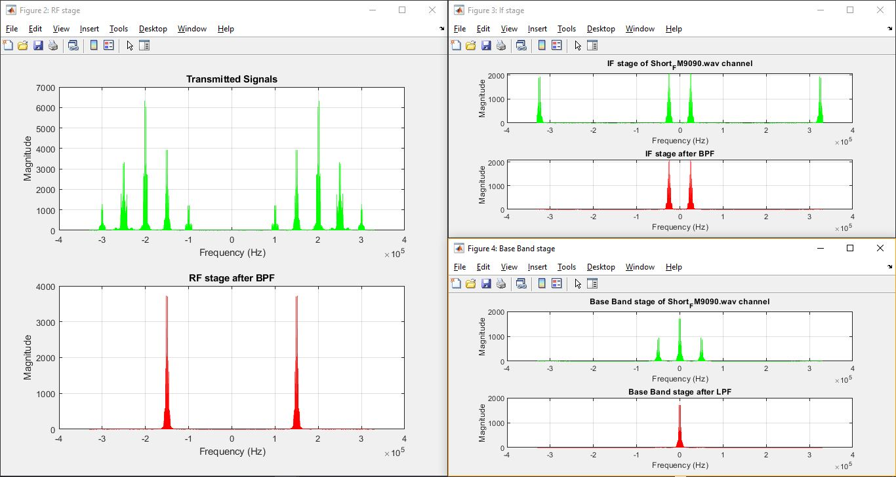

# _**Super-heterodyne Receiver**_
> ## _Project Description_
   * The purpose of this project is to simulate the basic components of an analog communication system using
    MATLAB programming. Specifically, an AM modulator and a corresponding super-heterodyne receiver
    will be simulated using radio-station generated signals.
> ## _Contents_
   * _Audio Signals_ : audio signals that used during testing
   * _Screens_       : output figures
   * _Source Code_   : MATLAB file 
> ## _Project Requirements_
* `MATLAB` program recommended version 2021

> ## _Block Diagram_


> ## _Result Figures_



> ## __Removing RF stage__
```MATLAB
%%%%%%%%%% comment this part if yoy want to demodulate without RF stage %%%%%%%%%%
% sum_signals_BPF = sum_signals;
band_pass_filter = fdesign.bandpass(F_stop1, F_pass1, F_pass2, F_stop2, A_stop1, A_pass, A_stop2, 15 * Fs);
band_pass_filter = design(band_pass_filter, 'equiripple');
sum_signals_BPF = filter(band_pass_filter, sum_signals);
SUM_SIGNALS_BPF = fftshift(fft(sum_signals_BPF));
f_MODULATED_SIGNAL = (-length(SUM_SIGNALS_BPF) / 2:1:length(SUM_SIGNALS_BPF) / 2 - 1)';
subplot(2, 1, 2)
plot(f_MODULATED_SIGNAL * Fs_carrier / length(SUM_SIGNALS_BPF), abs(SUM_SIGNALS_BPF), 'r')
title("RF stage after BPF for audio " + choose_signal)
xlabel("Frequency (Hz)")
ylabel("Magnitude")
grid on
```

> ## __Offset in Receiver Oscillator frequency__
```MATLAB
%%%%%%%%%% the receiver oscillator offset [0, 0.1k, 1k] %%%%%%%%%%
offset = 0;
IF = 25000 + offset;                                % If frequency 25 KHz
```

> ## __Run Program__
   * by running code, user required to choose which audio he want to hear as in the following figure

   
> ### Team members
   - **Omr Amr Mahmoud Hafez** 
   - **Mohamed Khaled Mohamed Alahmady**

